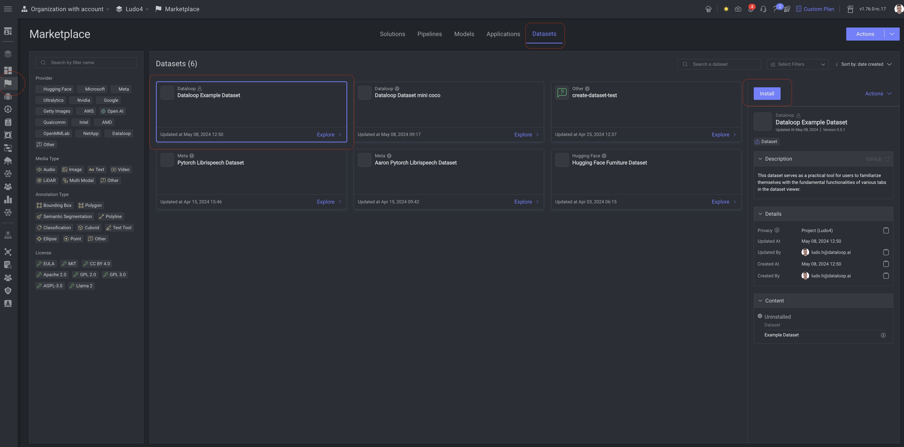
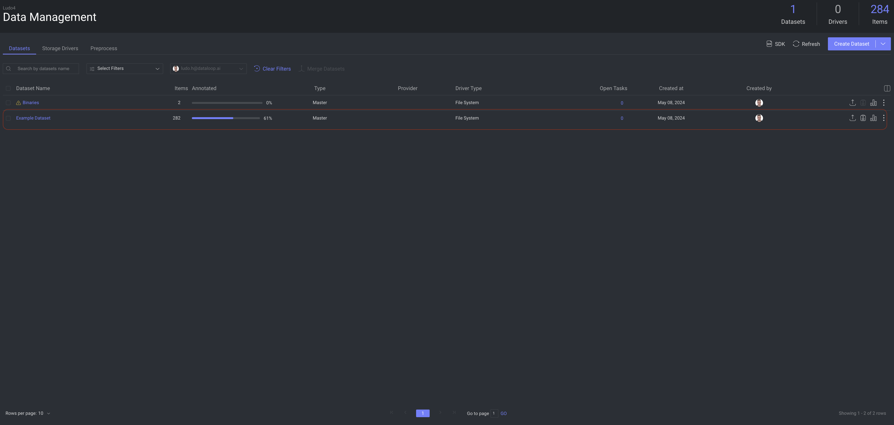

# Animal Dataset Adapter

## Description

This dataset contains images of animals with various characteristics and annotations. It is designed to help users get familiar with the data management capabilities of the Dataloop platform, including clustering, cleanup, and insights. The dataset includes the following types of images:

- **Bounding Box Annotations**: Some images comes with bounding box annotations to highlight the animals within the images.
- **Blurred/Sharp Images**: The dataset contains a mix of blurred and sharp images to simulate different image qualities.
- **Duplicates**: There are duplicate images included to help practice deduplication techniques.
- **Bright/Dark Images**: The images vary in brightness to provide a range of lighting conditions.

## Installation

1. Go to the **Marketplace**.
2. Select the **Datasets** tab.
3. Select the **Dataset** from the card view.
4. Click on **Install**.

After a while, a new dataset will be created and visible under your **Data** section.

